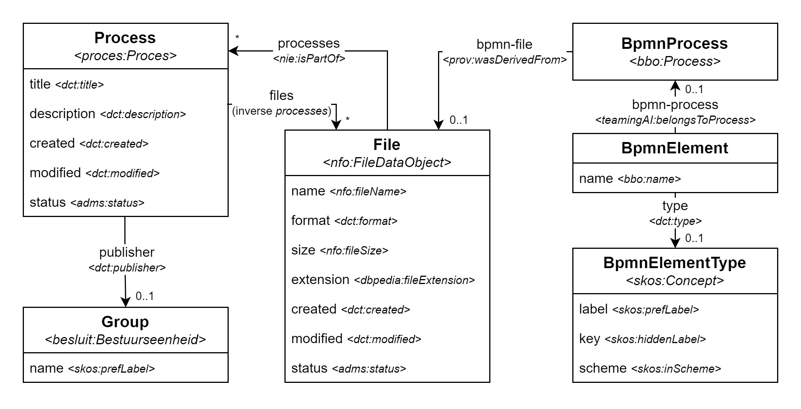

# Open Proces Huis (microservices stack)

This repo holds the docker compose and all configuration files necessary to get Open Proces Huis running. It was started using the [mu-project template](https://github.com/mu-semtech/mu-project) and has since been heavily expanded.

Open Proces Huis is one of many applications developed under the [Agentschap Binnenlands Bestuur (ABB)](https://www.vlaanderen.be/agentschap-binnenlands-bestuur), which is part of the [Flemish Government](https://www.vlaanderen.be/en). It allows for _lokale besturen_ to create and share processes. Such process is created by uploading a BPMN file, which is subsequently stored by the [file-service](https://github.com/mu-semtech/file-service), as well as processed by the [bpmn-service](https://github.com/lblod/bpmn-service). The latter was developed as part of Open Proces Huis and essentially extracts the BPMN elements from a given BPMN file and stores them as triples in the [Virtuoso](https://github.com/tenforce/docker-virtuoso) triplestore. To make all functionalities available as a web application, a [frontend](https://github.com/lblod/frontend-openproceshuis) was also developed.

In addition to the aforementioned services, a range of others are also essential to the stack. All of them are listed in [this overview](#overview-of-services), and can of course also be found in [`docker-compose.yml`](./docker-compose.yml).

## Getting started

### First run

1. Clone this repository

```bash
git clone https://github.com/lblod/app-openproceshuis.git
```

2. Add the following to `docker-compose.override.yml`

```yml
services:
  op-public-consumer:
    environment:
      DCR_LANDING_ZONE_DATABASE: "virtuoso" # Only on first run
      DCR_REMAPPING_DATABASE: "virtuoso" # Only on first run
      DCR_DISABLE_DELTA_INGEST: "true" # Only on first run
```

3. Run and wait for the migrations to finish

```bash
docker compose -f docker-compose.yml -f docker-compose.dev.yml -f docker-compose.override.yml up -d migrations
```

4. Run and wait for the OP consumer to finish

```bash
docker compose -f docker-compose.yml -f docker-compose.dev.yml -f docker-compose.override.yml up -d database op-public-consumer
```

5. Update `docker-compose.override.yml`

```yml
services:
  # op-public-consumer:
  #   environment:
  #     DCR_LANDING_ZONE_DATABASE: "virtuoso" # Only on first run
  #     DCR_REMAPPING_DATABASE: "virtuoso" # Only on first run
  #     DCR_DISABLE_DELTA_INGEST: "true" # Only on first run
```

6. Start the (complete) application

```bash
docker compose -f docker-compose.yml -f docker-compose.dev.yml -f docker-compose.override.yml up -d
```

> On consequent runs, only this last step should be performed.

### Usage

- You can access the frontend in your browser by going to [localhost](http://localhost/).
- You can log in using a mock account by going to [localhost/mock-login](http://localhost/mock-login).

## Data domain

All data is stored as triples in the [Virtuoso](https://github.com/tenforce/docker-virtuoso) triplestore. However, the default way of accessing this data, is by using the REST API provided by the [mu-migrations-service](https://github.com/mu-semtech/mu-migrations-service). This service acts based on [`domain.lisp`](./config/resources/domain.lisp), which stipulates how the API classes should be mapped to the resources from the triplestore. What follows, is a visualization of the domain made up of the different API classes, alonside the underlying RDF triples as can be found in the triplestore.



> The prefixes used in the diagram are equivalent to the ones used throughout the project. Their definitions can be found in [`repository.lisp`](./config/resources/repository.lisp).

> The definition of `Group` can be found in [`auth.json`](./config/resources/auth.json), alongside all other classes that are necessary for user management (not visible in the diagram).

> The `BpmnElement` class is in fact only an interface for all true BPMN element classes available. These are mapped onto RDF resources that comply with the [_BPMN Based Ontology (BBO)_](https://www.irit.fr/recherches/MELODI/ontologies/BBO/index-en.html).

## Dispatching

Different services from the stack handle different HTTP requests. The [mu-dispatcher](https://github.com/mu-semtech/mu-dispatcher) service makes sure each request gets dispatched to the correct service. The exact dispatching rules are described in [`dispatcher.ex`](./config/dispatcher/dispatcher.ex).

## Mu-search

Organizations typically have multiple processes, with each process covering one or more BPMN files, and each BPMN file holding multiple process steps. This obviously results in lots of `BpmnElement` resources being stored in the triplestore. Also, since all data is public, retrieving a list of process steps, forces the query engine to go over all organizational graphs, which naturally leads to long waiting times for users. To make matters worse, the [frontend](https://github.com/lblod/frontend-openproceshuis)'s process steps route introduces filters (e.g. filtering out archived process's process steps) that translate to SPARQL queries with very long RDF paths, which the query engine needs to traverse for every `BpmnElement` it has found. In light of better user experience, it was thus decided to make use of [mu-search](https://github.com/mu-semtech/mu-search) for the retrieval of process steps.

> In essence, mu-search serves as a bridge between a triplestore and an elasticsearch cluster. The triplestore still serves as the storage medium for the original linked data, but part of that data is also indexed by an elasticsearch cluster to allow for better retrieval performance, as well as having more options regarding search queries. Which part of the original data should be indexed, is defined in a configuration file.

### Configuration

The [OPH mu-search configuration file](./config/search/dev/config.json) on the one hand determines how process steps and the necessary attributes should be stored, and on the other defines which indexes should be created on start-up.

#### Types

Each element found in a BPMN process is considered a process step. In other words, multiple RDF types fall under the `BpmnElement` denominator. The configuration's `types` section defines that any resource of a given RDF type (these are all BBO types) can be considered a `bpmn-element` and indexed as such. Based on what the frontend's process steps route needs, a series of properties is subsequently defined. This not only includes _direct_ properties, but also nested ones:

- `name`
- `type.label`
- `type.key`
- `bpmn-process.bpmn-file.name`
- `bpmn-process.bpmn-file.status`
- `bpmn-process.bpmn-file.processes.title`
- `bpmn-process.bpmn-file.processes.status`

#### Indexes

Mu-search is implemented to create an elasticsearch index for each authorization group. When it receives a request from an authorization group it already has an index for, it will retrieve the requested data in the corresponding index. In the other case, it will first create a new index by querying the triplestore for data as defined in the `types` section. However, since the triplestore will typically hold an enormous amount of process steps, this indexing step would take a long time, again negatively impacting the user experience. For that reason, `eager_indexing_groups` are defined, forcing elasticsearch to create an index for each of the given authorization groups when the service is spinned up for the first time.

Since there is a large amount of organizations that can access OPH, this eager indexing step will take a long time to complete and take in a considerable amount of storage space. Naturally, this would only bother developers while spinning up an instance of the application locally. For that reason, the main configuration file ([`config/search/dev/config.json`](./config/search/dev/config.json)) only defines the public authorization groups. For production purposes, on the other hand, an extended configuration file ([`config/search/prd/config.json`](./config/search/prd/config.json)) is provided, containing all authorization groups that might at one point access OPH.

> The production-intended configuration was generated by the [`generate-elastic-config-prd.rb` script](./scripts/generate-elastic-config-prd.rb), and can be recreated as such whenever deemed necessary.

At the time of writing, 3541 indeces were necessary for the production-intended configuration. Taking into account that elasticsearch by default creates two shards per index, the necessary amount of shards (2 x 3541 = 7082) significantly surpasses elasticsearch's default maximum of 1000 shards. To expand this maximum to a sufficient 8000, the [`increase-shards-elastic.sh` script](./scripts/increase-shards-elastic.sh) can be run on the machine that needs to hold this large number of indexes.

> The [`reset-elastic.sh` script](./scripts/reset-elastic.sh) can be run to properly remove all elasticsearch indexes and associated data.

## Overview of services

- [frontend-openproceshuis](https://github.com/lblod/frontend-openproceshuis)
- [mu-identifier](https://github.com/mu-semtech/mu-identifier)
- [mu-dispatcher](https://github.com/mu-semtech/mu-dispatcher)
- [sparql-parser](https://github.com/mu-semtech/sparql-parser)
- [virtuoso](https://github.com/tenforce/docker-virtuoso)
- [mu-migrations-service](https://github.com/mu-semtech/mu-migrations-service)
- [mu-cl-resources](https://github.com/mu-semtech/mu-cl-resources)
- [mu-cache](https://github.com/mu-semtech/mu-cache)
- [delta-notifier](https://github.com/mu-semtech/delta-notifier)
- [file-service](https://github.com/mu-semtech/file-service)
- [bpmn-service](https://github.com/lblod/openproceshuis-bpmn-service)
- [visio-service](https://github.com/lblod/openproceshuis-visio-service)
- [account-detail-service](https://github.com/lblod/account-detail-service)
- [mu-search](https://github.com/mu-semtech/mu-search)
- [mu-search-elastic-backend](https://github.com/mu-semtech/mu-search-elastic-backend)
- [delta-consumer](https://github.com/lblod/delta-consumer)
- [acmidm-login-service](https://github.com/lblod/acmidm-login-service)
- [api-proxy-service](https://github.com/lblod/api-proxy-service)
- [loket-report-generation-service](https://github.com/lblod/loket-report-generation-service)
- [mock-login-service](https://github.com/lblod/mock-login-service)
- [update-bestuurseenheid-mock-login-service](https://github.com/lblod/update-bestuurseenheid-mock-login-service)
